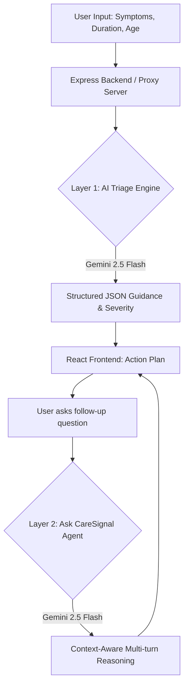

# 🩺 CareSignal

CareSignal is a lightweight symptom checking web app that helps users decide whether to monitor at home, visit a clinic, or seek emergency care based on how they feel.

It uses an AI-driven triage engine, backed by local risk logic, to provide clear and reliable next steps in seconds.

---

## 📸 Screenshots

| Landing Page | Symptom Selection | Result Screen |
|:---:|:---:|:---:|
|  |  |  |

---

## 🚀 Features

- **AI-Driven Risk Assessment**  
  Gemini analyzes symptoms to instantly determine severity (Safe, Clinic, Emergency)

- **Structured Guidance and Follow up**  
  Generates context-aware next steps, timelines, and supports conversational follow up

- **Multilingual Support**  
  English 🇬🇧 and Bahasa Malaysia 🇲🇾

- **Nearby Care Finder**  
  Opens Google Maps to find nearby clinics or hospitals

---

## ⚡ How It Works

1. **Symptom Input**  
   Users select predefined symptoms or add custom ones  

2. **Risk Evaluation**  
   The AI (with a local fallback) instantly determines the severity  

3. **AI Guidance**  
   Gemini generates structured next steps, timelines, and warning signs  

4. **Language Toggle**  
   Users can switch between English and Bahasa Malaysia without regenerating core results  

---

## 🌍 Problem & National Impact (Track 3: Vital Signs)

**The Problem:** Many Malaysians are unsure whether their symptoms require urgent care or can be safely monitored at home. This leads to two critical issues: panic-driven overcrowding in Emergency Departments (EDs) or dangerous delays in seeking necessary care.

**National Alignment:** CareSignal directly addresses **Track 3: Vital Signs** of the MyAI Future Hackathon. By providing instant, accessible triage, it aligns with the **MyDIGITAL blueprint** and **NIMP 2030** goals for digital public health infrastructure, specifically addressing the strain on public hospitals as Malaysia transitions to an "Aged Society".

---

## 🏗️ Architecture & Agentic Workflow

CareSignal implements a **Two-Layer Agentic AI Architecture** built entirely on the Google AI Ecosystem Stack, transitioning from a simple chat interface to an autonomous, context-aware execution system.



### 🧠 The Agentic Workflow
Unlike a standard chatbot, **Ask CareSignal operates as an Agentic AI system**:
1. **Context Injection:** It autonomously ingests the full symptom array, severity level, and demographic data *before* the conversation begins.
2. **Stateful Reasoning:** The backend `/api/gemini/chat` endpoint maintains full conversation history across multiple turns, allowing Gemini to reason over prior messages.
3. **Constrained Action:** The agent is strictly prompted to provide actionable, practical follow-up guidance anchored to the user's initial triage result, rather than generic medical trivia.

### 💻 Tech Stack
- **Frontend:** React 19, TypeScript, Vite, Tailwind CSS (Mobile-first UX)
- **Backend:** Node.js, Express.js (Secure Proxy, Rate Limiting, Helmet)
- **AI Engine:** Google Gemini (`gemini-2.5-flash` for both triage and chat)
- **Deployment:** Dockerized and deployed serverless on **Google Cloud Run**  

---

## 🧠 Key Design Decisions

- **AI-driven triage first**  
  Gemini is used as the core decision engine for highly accurate severity assessment  

- **Robust local fallback**  
  The core experience relies on a local rule-based system if the AI API fails  

- **Mobile first UX**  
  Designed with sticky actions and low friction flows  

- **Cost aware AI usage**  
  Responses are reused across language toggles to reduce API calls  

- **Structured AI output**  
  AI is constrained to return predictable JSON for reliability  

---

## 🤖 AI Usage Disclosure

This project strictly adheres to the "Build with AI" mandate and ethical guidelines.

**Google AI Ecosystem Used:**
- **Gemini 2.5 Flash** acts as the core intelligence engine for both the triage assessment and the agentic follow-up chat.
- **Google Cloud Run** hosts the serverless deployment.

**Development Tools:**
- AI coding tools (ChatGPT, Google Gemini) were used to assist with UI boilerplate and prompt refinement.
- **The core system design** (risk classification logic, rate-limiting proxy, bilingual caching, and multi-turn context management) was implemented manually by the team.

**Safety & Limitations:**
All AI outputs are constrained via strict system prompts and validated before reaching the client. A hard-coded local fallback logic exists to ensure users always receive guidance even if the AI service degrades. The system does not diagnose diseases.

---

## 📦 Setup

### Prerequisites
- [Node.js](https://nodejs.org/) 20+
- A [Google Gemini API key](https://aistudio.google.com/apikey)

### Installation & Run

```bash
git clone https://github.com/rithhaikal/caresignals.git
cd caresignals
npm install

# Setup Environment Variables
cp .env.example .env
# Edit .env and add your GEMINI_API_KEY

# Start Backend (Terminal 1)
node server.js 

# Start Frontend (Terminal 2)
npm run dev
```

The app will be available at `http://localhost:5173`.

### Docker

```bash
docker build -t caresignal .
docker run -p 8080:8080 -e GEMINI_API_KEY=your_key caresignal
```

---

## ⚠️ Disclaimer & Limitations

- **Not a medical diagnosis tool.** This application is for informational purposes only and does not replace professional medical advice. Always consult a qualified healthcare provider for medical concerns.
- AI acts as the primary triage engine for severity classification, with local predefined logic serving as a robust safety fallback if the AI is unavailable.
- AI assisted tools (ChatGPT & Gemini) were used during development for UI iteration and prompt design, but core logic was built manually.
