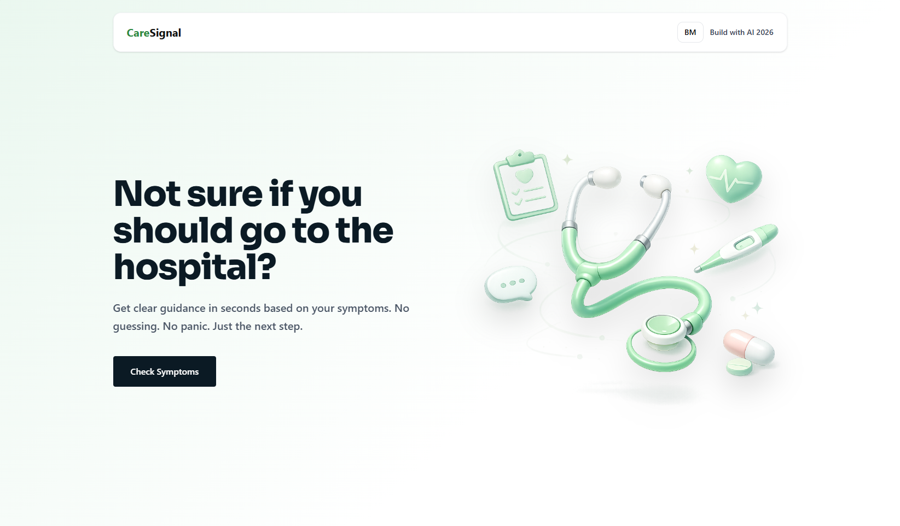
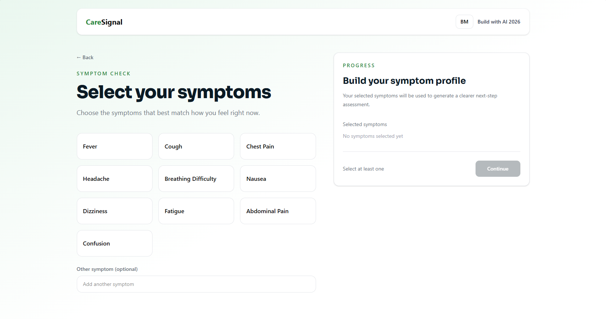
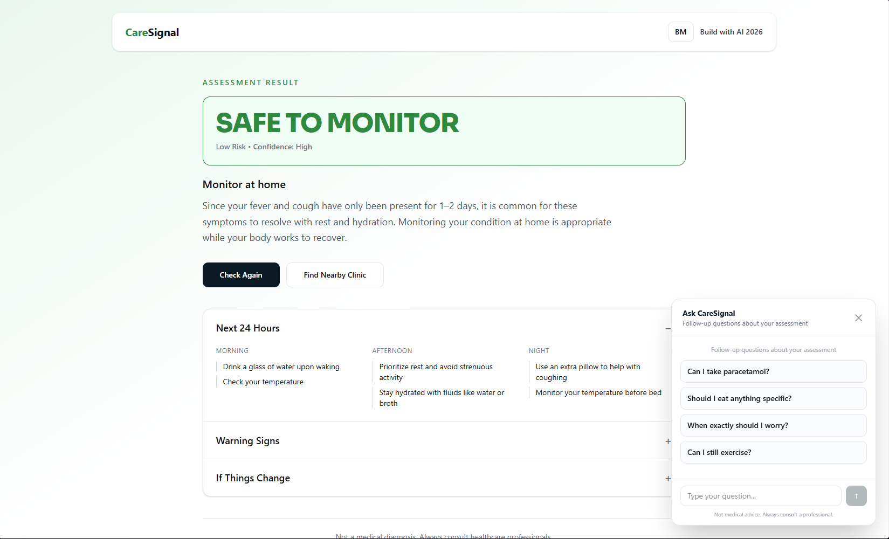

# 🩺 CareSignal

CareSignal is a lightweight symptom-checking web app that helps users decide what to do next based on how they feel — whether to monitor at home, visit a clinic, or seek emergency care.

It combines rule-based risk logic with AI-generated guidance to provide clear, structured next steps in seconds.

---

## 📸 Screenshots

### Landing Page


### Symptom Selection


### Result Screen


---

## 🚀 Features

- Select symptoms from a predefined list  
- Add custom symptoms manually  
- Instant risk assessment (Safe, Clinic, Emergency)  
- AI-generated guidance for next 24 hours  
- Warning signs and escalation triggers  
- English 🇬🇧 / Bahasa Malaysia 🇲🇾 support  
- Find nearby clinics or hospitals via Google Maps  

---

## ⚡ How It Works

1. **Symptom Input**  
   Users select predefined symptoms or add their own  

2. **Risk Evaluation**  
   A rule-based system determines severity instantly  

3. **AI Guidance**  
   Gemini generates structured next steps, timelines, and warning signs  

4. **Language Toggle**  
   Users can switch between English and Bahasa Malaysia  

---

## 🧠 Tech Stack

- **Frontend**: React + TypeScript  
- **Styling**: Tailwind CSS  
- **AI**: Google Gemini API  
- **State Management**: React Hooks  

---

## 💡 Key Design Decisions

- **Instant results first**  
  Users see severity immediately without waiting for AI  

- **AI as enhancement, not dependency**  
  The core system works even if AI fails or is unavailable  

- **Mobile-first UX**  
  Designed to avoid scrolling friction with sticky actions  

- **Cost-aware AI usage**  
  AI responses are reused across language toggles to reduce API calls  

- **Structured output design**  
  AI is constrained to return predictable JSON for reliability  

---

## 🤖 AI Usage Disclosure

This project uses AI-assisted tools during development, including ChatGPT and Google Gemini.

AI was used to:
- Assist with UI implementation and iteration  
- Help structure and refine prompt design  
- Generate contextual guidance for users based on symptoms  

The core system design — including risk classification logic, UX flow, and decision structure — was built and defined manually.

All AI-generated outputs are constrained, validated, and integrated into a controlled system. The team understands and can explain all parts of the codebase and architecture.

---

## 🧪 Limitations

- Not a medical diagnosis tool  
- Uses predefined logic for severity classification  
- AI responses may vary depending on input and API performance  

---

## ⚠️ Disclaimer

This application is for informational purposes only and does not replace professional medical advice. Always consult a qualified healthcare provider for medical concerns.

---

## 📦 Setup

```bash
npm install
npm run dev
